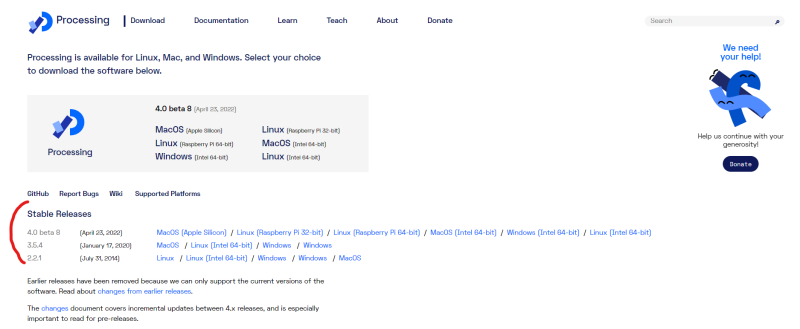

# Formation : Introduction à Processing

## Introduction
La programmation est un vaste domaine de l'informatique permettant le développement d'applications et de services exécutables par ordinateur. Apprendre un langage de programmation est à la portée de tous. Néanmoins, cet apprentissage nécessite une logique et une capacité d'analyse accrue afin de pouvoir écrire les algorithmes structurant vos créations. Dans ce cours, vous allez apprendre les bases de la programmation en utilisant Processing dans le but de créer quelques un mini-jeux tel que "Pong".

## Processing
Processing est un carnet de croquis logiciel flexible et un langage de programmation (PL) pour apprendre à coder dans le contexte des arts visuels. Depuis 2001, Processing fait la promotion de la littératie logicielle dans les arts visuels et de la littératie visuelle dans la technologie. Il y a des dizaines de milliers d’étudiants, d’artistes, de concepteurs, de chercheurs et d’amateurs qui utilisent le traitement pour l’apprentissage et le prototypage.

Processing peut donc être utilisé dans tout domaines des arts visuelles tels que celui des jeux vidéo jusqu'au traitement d'images, par exemple, la dectection de mouvement.

### Installation

Rendez-vous sur [le site officiel de Processing](https://processing.org), descendez vers la section "Getting started", dans la catégorie "Get the software" vous retrouvez un bouton "Download Processing". Cliquer sur le bouton, vous serez redirigé vers la page de téléchargement, vous avez plus qu'a choisir la version du logiciel Processing (peut importe laquelle) qui correspond à votre système d'opération (OS) c'est-à-dire Windows, MacOS ou Linux.

Section "Getting started"

Catégorie "Get the software" avec le bouton "Download Processing"

Page de téléchargement

## Variables

## Types

## Opérateurs logiques

## Instructions conditionnelles

## Boucles

## Fonctions

## Programmation Orientée Objets