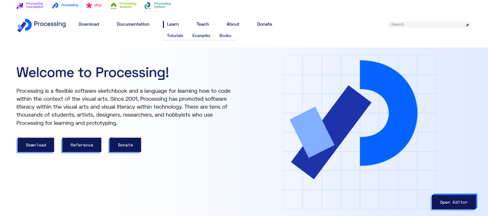
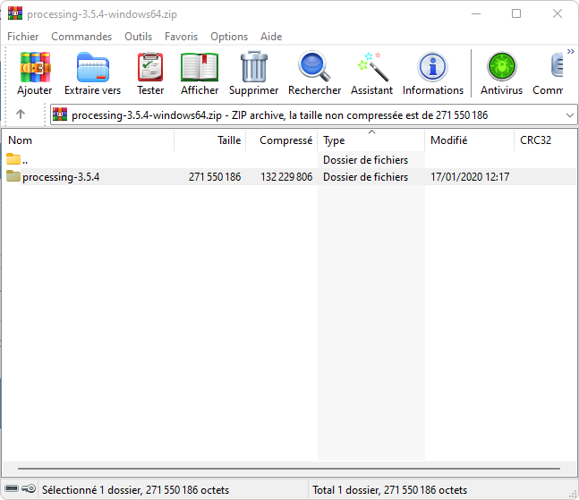
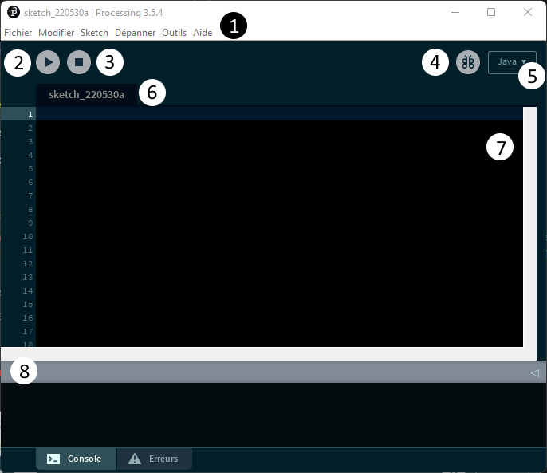
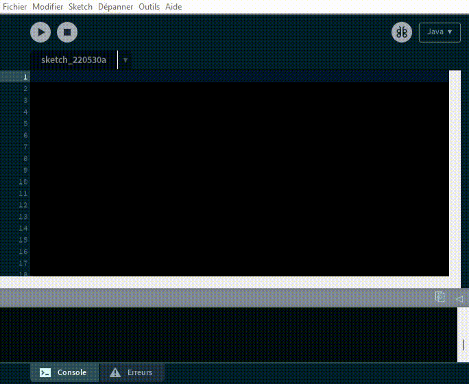

# Formation : Introduction à Processing

## Introduction
La programmation est un vaste domaine de l'informatique permettant le développement d'applications et de services exécutables par ordinateur. Apprendre un langage de programmation est à la portée de tous. Néanmoins, cet apprentissage nécessite une logique et une capacité d'analyse accrue afin de pouvoir écrire les algorithmes structurant vos créations. Dans ce cours, vous allez apprendre les bases de la programmation en utilisant Processing dans le but de créer quelques mini-jeux tel que "Pong".

## Processing
Processing est un carnet de croquis logiciel flexible et un langage de programmation (PL) pour apprendre à coder dans le contexte des arts visuels. Depuis 2001, Processing fait la promotion de la littératie logicielle dans les arts visuels et de la littératie visuelle dans la technologie. Il y a des dizaines de milliers d’étudiants, d’artistes, de concepteurs, de chercheurs et d’amateurs qui utilisent le traitement pour l’apprentissage et le prototypage.

Processing peut donc être utilisé dans tout domaines des arts visuelles tels que celui des jeux vidéo jusqu'au traitement d'images, par exemple, la dectection de mouvement.

### Installation



Rendez-vous sur [le site officiel de Processing](https://processing.org), descendez vers la section "Getting started", dans la catégorie "Get the software" vous retrouvez un bouton "Download Processing". Cliquer sur le bouton, vous serez redirigé vers la page de téléchargement, vous avez plus qu'a choisir la version du logiciel Processing (peut importe laquelle) qui correspond à votre système d'opération (OS) c'est-à-dire Windows, MacOS ou Linux.


Section "Getting started"


Catégorie "Get the software" avec le bouton "Download Processing"


Page de téléchargement


Suite au téléchargement, vous obtiendrez un document .zip qu'il faudra décompresser dans le dossier de votre choix : 




Vous pouvez maintenant acceder à l'application Processing:


### Présentation de l'IDE Processing

Un Environnement de Développement Intégré (IDE) est le logiciel qui vous premettra de "coder" des applications, en effet, ces logiciels vous permettent d'écrire dans les différents langages de programmation (que nous appelerons PL pour "Programming Language") supportés.

L'IDE Processing supporte de base les langages Java et Python. Ici, nous utiliserons Java pour le reste du cours.

Voici la page d'acceuil : 


Les fichiers/programmes sont appelés "sketch" contenant le code écrit pour votre programme.




1. Menu
2. Bouton "Run" : Execute le sketch
3. Bouton "Stop" : Arrête l'exécution du sketch
4. Bouton debugage
5. Menu défilant des options (choix des PL)
6. Barre d'onglets
7. Sketch
8. Console et console d'erreurs


### Hello world

Nous allons écrire notre premier programme ! Ce dernier devra renvoyer la phrase "Hello World!" dans la console : 

Pour cela, il existe une fonction (Nous définirons ce terme plus tard) qui affiche du contenu dans la console. Nous parlons de la fonction ```println()```.

Ecrivez la ligne suivante dans le sketch :

```java
println("Hello World!");
```


## Structure d'un sketch Processing

On retrouve dans un sketch deux fonctions fondamentales nommées ```setup()``` et ```draw()``` que nous allons étudier:

### setup()

```setup()``` est une fonction qui s'exécute qu'une seule fois lors du début du programme. Elle est codée de la manière suivante :

```java
void setup() {
	// Instructions
}
```

Le mot-clé "void" est le type de l'élément de retour de cette fonction, ici, la fonction setup() ne renvoie rien, c'est pourquoi sont type de retour est dit "vide".

### draw()

```draw()``` est une fonction qui s'exécute en boucle en lisant les instructions de haut en bas tant que l'exécution du sketch n'est pas arrêté.
Elle est codée de la manière suivante :

```java
void draw() {
	// Instructions
}
```

La fonction ```draw()``` est de type "void" comme la fonction ```setup()```.

Voyons ce que ça donne à l'exécution :



## Variables

Les variables sont des espaces de la mémoire réservés afin d'y attribuer une valeur. Les variables sont composées de trois éléments : 

- Un type
- Un nom
- Une valeur

La création d'une variable est nommé "déclaration de variable", déclarons différentes variables : 

```java
int a = 4;
int b = 5;
```

Nous avons déclaré deux variables, la variable "a" et la variable "b". Si l'on décompose ces variable en les trois éléments dont nous parlions ci-dessus alors :

- Quel est le type, le nom et la valeur de la variable "a" ?
<details>
	<summary>Réponse</summary>
	Type : int, Nom : a, Valeur : 4
</details>

- Même question pour la variable "b" ?
<details>
	<summary>Réponse</summary>
	Type : int, Nom : b, Valeur : 5
</details>

ATTENTION : Comme vous avez pu le voir, chaque déclaration est succédé d'un point virgule, celà est dû à la synthax de Java qui veut que chacune des instructions de code se finisse par un point virgule.

On en conclut donc qu'une déclaration de variable est une instruction de code.

### Exercice 1

Créer un sketch où vous allez déclarer trois variables de type ```int``` nommées a, b et c avec :

- a = 6
- b = 7
- c = 100

Afficher ensuite une seul fois les variables b et c dans la console puis la variable a en dernière.

<details>
	<summary>Réponse</summary>
	<pre>
		<code>
		  int a = 6;
		  int b = 7;
		  int c = 100;		  
		  println(b);
		  println(c);
		  println(a);
		</code>
	</pre>

	7

	100

	6

</details>


## Types

On appelle "type de donnée" ou plus simplement "type" la nature des valeurs que peut prendre une donnée.

Processing appelle "Data" les types dits `primitifs`, les types dits `composites` ainsi que les fonctions qui leurs correspondent. Ici nous allons nous attarder uniquement sur les types contenus dans le terme "Data".

### Primitive

On appelle `Primitive` les types de données suivantes :

- *boolean* : Les valeurs booléenne `true` et `false`
- *byte* : Les valeurs numériques contenues dans 8 bits (octet) en binaire signé -> de 127 à -128
- *char* : Les valeurs représentant un caractère tel que des lettres ou des symboles (A, b, €)
- *color* : Les valeurs représentant des couleurs, en RGB, en ARGB et en hexadecimal
- *double* : Les valeurs à virgule contenues dans l'intervalle de 64 bits
- *float* : Les valeurs à virgule contenues dans l'intervalle de 32 bits
- *int* : Les valeurs entières contenues dans l'intervalle de 32 bits
- *long* : les valeurs entières contenues dans l'intervalle de 64 bits

### Composite

On appelle `Composite` les types de données suivantes : 

- *Array* : Liste de données
- *ArrayList* : Liste d'objets 
- *FloatDict* : Dictionnaire contenant des float
- *FloatList* : Liste contenant uniquement des float
- *HashMap* : Hashmap contenant une collection d'objects
- *IntDict* : Dictionnaire contenant des int
- *IntList* : Liste contenant uniquement des int
- *JSONArray* : Tableau respectant la synthax JavaScript Object Notation
- *JSONObject* : Object respectant la synthax JavaScript Object Notation
- *Object* : Instance de classes
- *String* : Chaine de caractères
- *StringDict* : Dictionnaire contenant des String
- *StringList* : Liste contenant uniquement de String
- *Table* : Classe permettant de manipuler des fichier tableurs (.csv, .tsv)
- *TableRow* : Objet représentant une ligne d'une instance de `Table`
- *XML* : Classe représentant le noeud d'un arbre `XML`

### À retenir

Les principaux types à retenir sont :

- `int`
- `float`
- `boolean`
- `color`
- `String`
- `Array`

D'autre types sont interressants, tels que les `JSONArray`, les `JSONObject` et les `Object`, mais nous en parlerons plus tard dans la formation.

Voici un exemple de déclaration de variables avec les types précédents : 

```java
int a = 1; // 1
float b = .5; // 0,5
boolean bool = true; // Valeur booléenne "vraie"
color c = #FFFFFF; // Code hexadecimal de la couleur blanche
String text = "Bonjour!"; // Chaîne de caractères
int[] num = new int[3]; // Array de 3 nombres entiers
```

### Exercice 2

#### Question 2.1

Quel est le type associé à la valeur `false` ?
<details>
	<summary>Réponse</summary>
	R : <code>boolean</code>.
</details>

#### Question 2.2

Déclarons trois variables : 
```java
char a = 'A'; // (1)
char[] b = new char[5]; // (2)
String c = "Bonjour!"; // (3)
```

Quel est la différence entre la déclaration d'un caractère (1) et d'une chaine de caractères (2) ?
<details>
	<summary>Réponse</summary>
	R : L'utilisation des "simple quotes (')" et des "double quotes (")" différencie en Java le type d'une donnée. On utilise l'apostrophe pour un <code>char</code> et les guillomets pour les <code>String</code>.
</details>

#### Question 2.3

Dans le même contexte, quel est le type de cette variable (2) ? Que veut dire `new char[5]` ?
<details>
	<summary>Réponse</summary>
	<p>R1 : C'est un <code>Array</code> contenant des <code>char</code>.</p>
	<p>R2 : C'est la création d'une <code>nouvelle liste</code> spécifiant son contenu exclusif en <code>char</code> et sa <code>taille de 5 emplacements</code>.
	Exemple : </p>
</details>

#### Question 2.4

Quel est le code hexadecimal de la couleur noire ?
<details>
	<summary>Réponse</summary>
	R : <code>#000000</code>
</details>


## Opérateurs

Les opérateurs sont des fonctions sous forme de symboles qui permettent des calculs et de relations entre valeurs.

### Opérateurs mathématiques

#### Opérateurs mathématiques principaux

| Opérateur | Symbole | Exemple    |
|:----------|:-------:|:-----------|
| Addition  | +       | 5+5 -> 100 |


### Opérateurs au niveau du bit

### Opérateurs relationnels

### Opérateurs logiques

## Instructions conditionnelles

## Boucles

## Fonctions

## Programmation Orientée Objets

## Mini-projet : Le chat vous suit des yeux!

## Projet final : Pong 